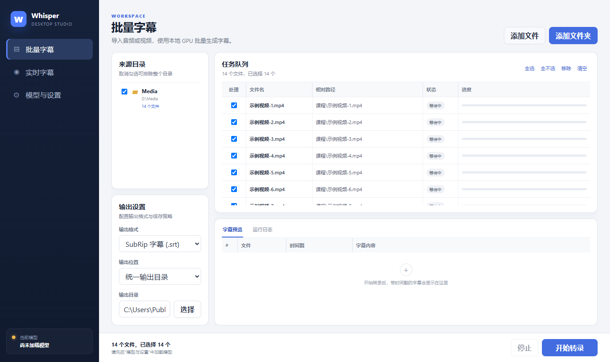
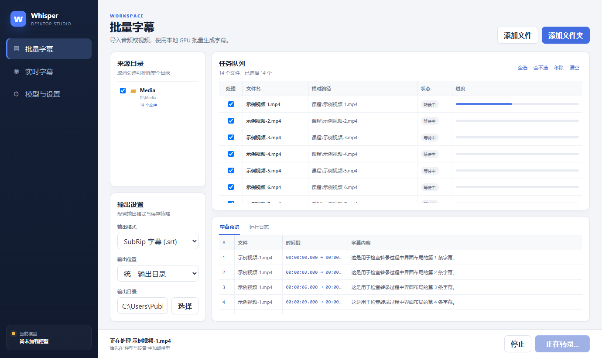
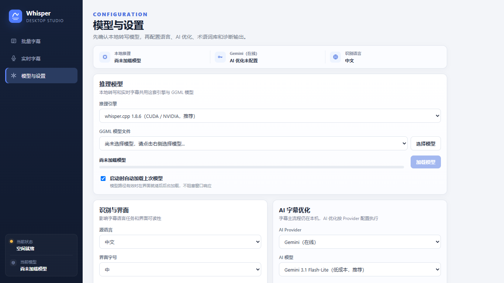
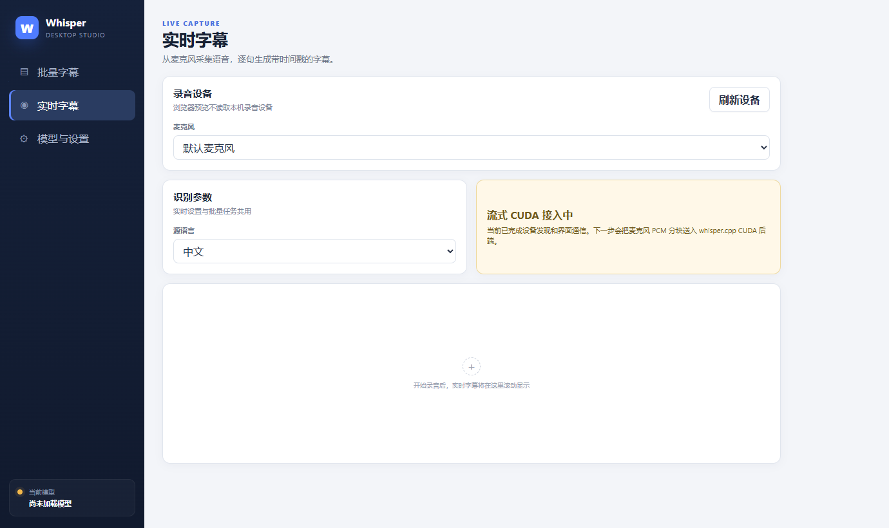

# WhisperDesktop（Windows）

WhisperDesktop 是一个运行在 **Windows 64 位**上的本地语音转文字工具，
基于 OpenAI Whisper 模型的 C/C++ 实现，可将音频、视频或麦克风输入转录为文本。

本项目适合：
- 会议/访谈录音整理
- 课程、播客、视频的文字转写
- 本地、离线的批量语音转录需求

---

## 快速开始

1. 在 **Releases** 页面下载 WhisperDesktop
2. 解压后运行 `WhisperDesktop.exe`
3. 首次使用请先下载并加载模型（推荐 `ggml-medium.bin`）

---

## 架构说明

本项目采用现代混合架构，由 WPF 薄壳 + WebView2 + React 前端 + 多引擎后端组成：

```
┌─────────────────────────────────────────────────┐
│           WPF 窗口 (WebView2 容器)                │
│  ┌─────────────────────────────────────────────┐ │
│  │         React Web UI (Vite + TypeScript)     │ │
│  │    批量字幕 │ 实时字幕 │ 模型与设置             │ │
│  └────────────────┬────────────────────────────┘ │
│                   │ JSON 消息桥                    │
│       ┌───────────┴───────────┐                   │
│       │     WhisperNet (.NET) │                   │
│       └───────────┬───────────┘                   │
│                   │                               │
│     ┌─────────────┼─────────────┐                 │
│     ▼             ▼             ▼                 │
│  CUDA 后端     CPU 后端     D3D11 后端             │
│ (whisper.cpp) (whisper.cpp) (Whisper.dll)         │
└─────────────────────────────────────────────────┘
```

- **WPF + WebView2**：桌面窗口外壳，所有 UI 由内嵌的 Web 页面渲染
- **React Web UI**：基于 Vite + React 19 + TypeScript 的现代前端
- **WhisperNet**：.NET 互操作层，提供模型加载、转录控制等接口
- **推理引擎（可选三种）**：

| 引擎 | 底层 | 适用场景 |
|------|------|---------|
| whisper.cpp CUDA | whisper.cpp v1.8.6 | **推荐**，NVIDIA 显卡速度最快 |
| whisper.cpp CPU | whisper.cpp v1.8.6 | 无独立显卡时使用 |
| D3D11（兼容版） | Whisper.dll (Const-me) | 旧版兼容，支持全系 DirectX 11 显卡 |

---

## 源码运行说明

如果是从源码运行，而不是直接使用 `Releases` 中的程序，建议按下面顺序操作。

### 每日构建包

需要生成一个可直接解压运行、并且能够按日期回退的版本时，在仓库根目录运行：

```powershell
Tools\package-daily.cmd
```

脚本会先执行 `Release / x64` 编译，然后输出：

```text
Releases\Daily\2026-06-13\WhisperDesktop\
Releases\Daily\2026-06-13\WhisperDesktop-2026-06-13-win-x64.zip
```

同一天重复执行会更新当天的包，不会产生按小时命名的多个版本。每个包内的
`BUILD-INFO.txt` 会记录构建日期、Git 分支、提交号以及构建时是否存在未提交修改。
每日构建使用独立的临时输出目录，因此正在运行的客户端不会锁住打包所需文件。
如需重新整理已有编译结果而不再次编译，可以运行
`Tools\package-daily.cmd -SkipBuild`。每日包为免安装的便携版，目标电脑需要安装
.NET 9 Desktop Runtime。

### 前置条件

- **Visual Studio 2022**（v143 工具链，含 C++ 桌面开发）
- **.NET 9 SDK**
- **Node.js**（用于构建 Web 前端）
- **CUDA Toolkit**（可选，编译 CUDA 后端时需要）

### 1. 使用 Visual Studio 打开并生成

1. 使用 Visual Studio 打开解决方案
2. 选择 `x64` 平台与 `Debug` 或 `Release` 配置
3. **先生成 `ComputeShaders` 项目**，再生成整个解决方案

> `ComputeShaders` 会生成 `Whisper\D3D\shaderData-Debug.inl` / `shaderData-Release.inl`。
> 如果出现 `E1696: 无法打开源文件 "shaderData-Debug.inl"`，通常就是这个生成步骤还没执行。

### 2. 构建 Web 前端

```powershell
cd Examples\WhisperDesktop.Web
npm install
npm run build
```

或者使用构建脚本：

```powershell
Tools\build-webui.cmd
```

构建产物会输出到 `Examples\WhisperDesktop.Web\dist\`，WPF 项目的 MSBuild 目标会在编译时自动将其复制到输出目录的 `Web\` 子目录。

> **开发模式**：可在 Web 目录执行 `npm run dev` 启动 Vite 开发服务器（默认 `localhost:5173`），
> WPF 宿主会在检测到开发服务器运行时自动连接，实现热更新开发。

### 3. 构建 whisper.cpp 后端（可选）

```powershell
Tools\build-whispercpp.cmd
```

此脚本会使用 CMake + Ninja 同时编译 CPU 和 CUDA 两个版本的后端 DLL：
- `WhisperCppBackendCpu.dll`
- `WhisperCppBackendCuda.dll`

### 4. 运行桌面程序

将 `Examples\WhisperDesktop.Wpf\WhisperDesktop.Wpf.csproj` 设为启动项目后直接运行即可。
WPF 窗口会通过 WebView2 加载 React 前端界面。

仓库中也保留了原版 C++ 桌面程序 `Examples\WhisperDesktop\WhisperDesktop.vcxproj`，
可作为兼容备选使用。

首次运行时仍需自行准备 Whisper 模型文件，例如：

- `models\ggml-medium.bin`
- `models\ggml-small.bin`

### 5. 命令行运行 .NET 示例

仓库中还包含基于 `WhisperNet` 的 .NET 示例。下面是常见运行方式。

#### 转录音频文件

```powershell
dotnet run --project Examples\TranscribeCS\TranscribeCS.csproj -c Debug -p:Platform=x64 -- -m models\ggml-medium.bin -l zh -otxt .\sample.wav
```

说明：

- `-m`：指定模型文件
- `-l zh`：指定语言为中文
- `-otxt`：同时输出 `.txt` 文本结果

#### 列出麦克风设备

```powershell
dotnet run --project Examples\MicrophoneCS\MicrophoneCS.csproj -c Debug -p:Platform=x64 -- -ld
```

#### 使用指定麦克风实时转录

```powershell
dotnet run --project Examples\MicrophoneCS\MicrophoneCS.csproj -c Debug -p:Platform=x64 -- -m models\ggml-medium.bin -l zh -c 0
```

说明：

- `-c 0`：使用编号为 `0` 的录音设备
- 可先通过 `-ld` 查看设备列表

### 6. 运行前的注意事项

- 请确保输出目录中存在 `Whisper.dll`
- 请确保模型文件路径正确
- .NET 示例默认目标为 `net9.0-windows`，需要本机安装对应 .NET 运行时
- 运行 WPF 版本需要系统已安装 WebView2 Runtime（Windows 11 及较新的 Windows 10 通常已内置）

## 界面与功能概览

### 批量字幕
导入音频或视频文件，使用本地 GPU 批量生成字幕



---

### 转录过程
带进度显示和实时字幕预览的转录界面



---

### 模型与设置
管理推理引擎（CUDA / CPU / D3D11）、模型文件以及语言配置



---

### 实时字幕
从麦克风采集语音，逐句生成带时间戳的字幕



---

## 主要特性

- 基于 Whisper 模型的本地语音识别
- 支持批量文件转录与实时麦克风转录
- Windows 原生实现：已原生兼容 MSVC v143 工具链，无需 Python 或任何额外运行时
- **支持多种 GPU 加速方式**：推荐 CUDA（NVIDIA），同时兼容 Direct3D 11 全系显卡
- 集成 **whisper.cpp v1.8.6** 推理引擎，支持 CUDA 与 CPU 双模式
- 现代 Web 界面（React + WebView2），美观易用
- **独家核心修复：彻底解决视频结尾处因音视频轨道长度不符引起的"大段静音死循环/幻觉"Bug，处理大型音视频稳如磐石。**
- **智能体(Agent)命令行引擎：全新打造的 `whisper-cli.exe` 彻底解决 Windows 控制台输出中文 `????` 乱码问题，支持无颜色纯净输出，专为脚本调用与大模型自动化爬取而生。**
- 深度支持中文与粤语：优化多语言代码映射，提供原生粤语选项
- 中文UI界面优化：细化输出格式后缀名提示，极致小白友好

---

## 系统要求

- **操作系统**：Windows 64 位（推荐 Windows 10 / 11）
- **推荐显卡**：NVIDIA GPU（支持 CUDA，推荐 RTX 系列获得最高速度）
- **兼容显卡**：任意支持 Direct3D 11 的 GPU（使用 D3D11 兼容引擎）
- **CPU**：支持 AVX / F16C 指令集
- **运行时**：WebView2 Runtime（Windows 11 通常已内置）

---

## 二次开发与改动说明

本项目基于上游 Whisper Windows 实现进行深度优化与二次开发，近期主要改动包括：

- **全新现代界面**：基于 WPF + WebView2 + React 架构重写了整个桌面界面，支持批量任务队列、字幕预览、运行日志等功能。
- **引入 whisper.cpp v1.8.6**：集成最新的 whisper.cpp 推理引擎，支持 CUDA 和 CPU 双模式，相比原 D3D11 后端大幅提速。
- **深度引擎Bug修复**：重写了 Media Foundation 的音频真实样本计算策略，并追加静态跳步启发式检测，双重防线彻底根除末尾静音陷阱现象。
- **控制台完美汉化**：重写了 C++ 控制台 Locale 激活代码与文本流输出逻辑，摒弃容易引发撕裂宽字符的彩色打印流，实现纯净化中文打印。
- 界面与交互体验优化，补充了 UI 选项后缀名标识。
- 底层工程配置更迭，全面一键无缝适配更通用的 Visual Studio v143 编译工具链。

> 本仓库侧重于"拿来即用"并**极度适合直接集成至现代自动化 AI Agent 智能体底层调用**。

---

## 免责声明

本软件按"现状（AS IS）"提供，不对识别准确率或使用结果作任何保证。
语音识别效果会受到音质、口音、噪声、模型大小等因素影响。

---

## 上游项目与致谢

- Whisper Windows 实现（Const-me）
  https://github.com/Const-me/Whisper
- whisper.cpp（C/C++ 实现，已集成 v1.8.6）
  https://github.com/ggml-org/whisper.cpp
- OpenAI Whisper 模型
  https://github.com/openai/whisper

---

## License

本项目遵循上游项目的开源许可证要求，
具体请查看仓库中的 `LICENSE` 文件。
