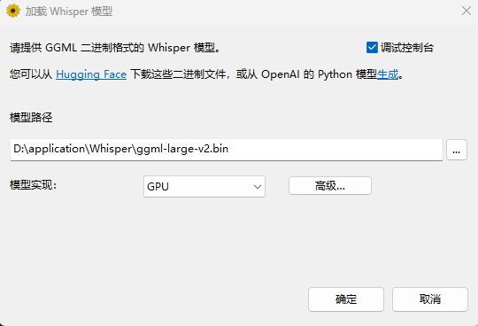
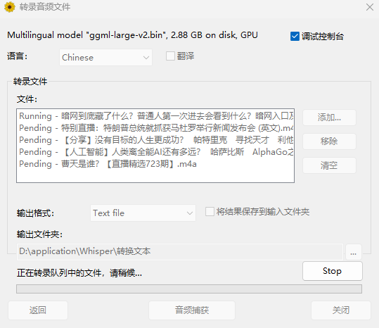
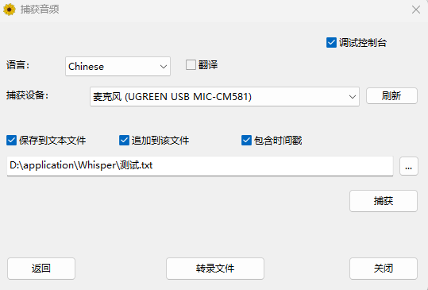
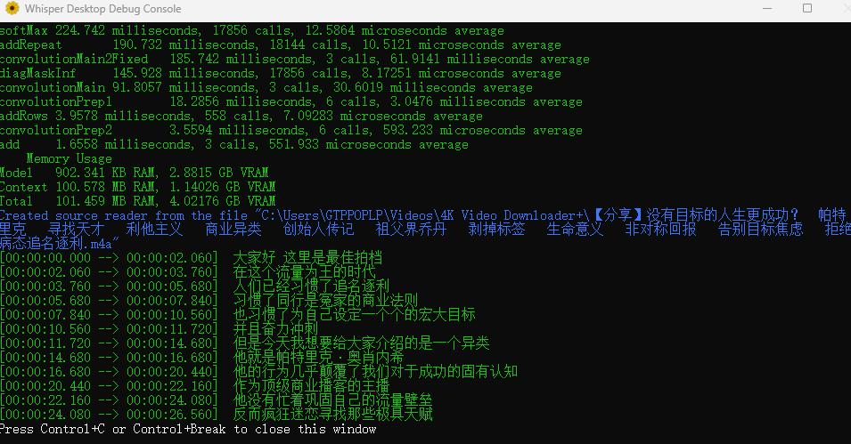

# WhisperDesktop（Windows）

WhisperDesktop 是一个运行在 **Windows 64 位**上的本地语音转文字工具，  
基于 OpenAI Whisper 模型的 C/C++ 实现，可将音频、视频或麦克风输入转录为文本。

本项目适合：
- 会议/访谈录音整理
- 课程、播客、视频的文字转写
- 本地、离线的批量语音转录需求

---

## 快速开始

1. 在 **Releases** 页面下载 WhisperDesktop
2. 解压后运行 `WhisperDesktop.exe`
3. 首次使用请先下载并加载模型（推荐 `ggml-medium.bin`）

---

## 源码运行说明

如果是从源码运行，而不是直接使用 `Releases` 中的程序，建议按下面顺序操作。

### 1. 使用 Visual Studio 打开并生成

1. 使用 Visual Studio 打开解决方案
2. 选择 `x64` 平台与 `Debug` 或 `Release` 配置
3. **先生成 `ComputeShaders` 项目**，再生成整个解决方案

> `ComputeShaders` 会生成 `Whisper\D3D\shaderData-Debug.inl` / `shaderData-Release.inl`。  
> 如果出现 `E1696: 无法打开源文件 "shaderData-Debug.inl"`，通常就是这个生成步骤还没执行。

### 2. 运行桌面程序

将 `Examples\WhisperDesktop\WhisperDesktop.vcxproj` 设为启动项目后直接运行即可。

首次运行时仍需自行准备 Whisper 模型文件，例如：

- `models\ggml-medium.bin`
- `models\ggml-small.bin`

### 3. 命令行运行 .NET 示例

仓库中还包含基于 `WhisperNet` 的 .NET 6 示例。下面是常见运行方式。

#### 转录音频文件

```powershell
dotnet run --project Examples\TranscribeCS\TranscribeCS.csproj -c Debug -p:Platform=x64 -- -m models\ggml-medium.bin -l zh -otxt .\sample.wav
```

说明：

- `-m`：指定模型文件
- `-l zh`：指定语言为中文
- `-otxt`：同时输出 `.txt` 文本结果

#### 列出麦克风设备

```powershell
dotnet run --project Examples\MicrophoneCS\MicrophoneCS.csproj -c Debug -p:Platform=x64 -- -ld
```

#### 使用指定麦克风实时转录

```powershell
dotnet run --project Examples\MicrophoneCS\MicrophoneCS.csproj -c Debug -p:Platform=x64 -- -m models\ggml-medium.bin -l zh -c 0
```

说明：

- `-c 0`：使用编号为 `0` 的录音设备
- 可先通过 `-ld` 查看设备列表

### 4. 运行前的注意事项

- 请确保输出目录中存在 `Whisper.dll`
- 请确保模型文件路径正确
- .NET 示例默认目标为 `net6.0-windows`，需要本机安装对应 .NET 运行时

## 界面与功能概览

### 加载模型
下载并选择 Whisper 模型文件（模型越大，效果通常越好）



---

### 转录文件
批量转录本地音频或视频文件，适合整理录音资料



---

### 捕获音频
从麦克风实时捕获并转录语音，适合会议或即时记录



---

### 调试控制台
提供中文 UI 与控制台输出，便于查看运行状态与日志



---

## 主要特性

- 基于 Whisper 模型的本地语音识别
- 支持批量文件转录与实时麦克风转录
- Windows 原生实现：基于 MSVC v145 开发，无需 Python 或额外运行时
- 支持 GPU 加速（Direct3D 11）：适配 RTX 3070 Ti 等主流显卡
- 新增 Whisper V3 Turbo 模型支持：兼顾识别速度与准确率
- 深度支持中文与粤语：优化多语言代码映射，提供原生粤语选项
- 中文界面与调试优化：支持控制台日志路径自定义，适合日常及工程使用

---

## 系统要求

- **操作系统**：Windows 64 位（推荐 Windows 10 / 11）
- **显卡**：支持 Direct3D 11 的 GPU
- **CPU**：支持 AVX / F16C 指令集

---

## 二次开发与改动说明

本项目基于上游 Whisper Windows 实现进行整理与二次开发，主要包括：

- 界面与交互优化，简化使用流程
- 中文界面与提示信息（部分由 AI 辅助翻译并调整）
- 使用体验与稳定性改进
- 功能取舍与精简，面向日常使用场景

> 本仓库更侧重“拿来即用”，而非底层实现细节。

---

## 免责声明

本软件按“现状（AS IS）”提供，不对识别准确率或使用结果作任何保证。  
语音识别效果会受到音质、口音、噪声、模型大小等因素影响。

---

## 上游项目与致谢

- Whisper Windows 实现（Const-me）  
  https://github.com/Const-me/Whisper
- whisper.cpp（C/C++ 实现）  
  https://github.com/ggerganov/whisper.cpp
- OpenAI Whisper 模型  
  https://github.com/openai/whisper

---

## License

本项目遵循上游项目的开源许可证要求，  
具体请查看仓库中的 `LICENSE` 文件。
