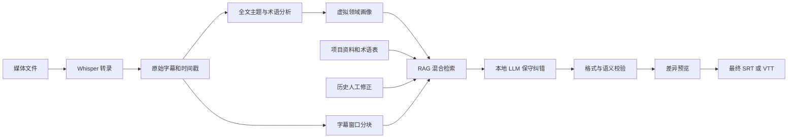

# 本地 AI 字幕后处理与 RAG 设计

状态：规划中，尚未实施  
记录日期：2026-06-11  
预计启动：后续迭代，可能在 2026 年 6 月下旬或 7 月  

## 1. 背景与目标

Whisper 负责把音频转成带时间戳的原始字幕。本方案在 Whisper 后增加本地大模型后处理，用于：

- 补充标点并改善断句。
- 修正常见同音字、专有名词和上下文相关的识别错误。
- 统一人名、产品名、技术术语和译名。
- 对翻译字幕进行保守润色。
- 保留时间戳、字幕编号和原始语义。
- 通过 RAG 使用项目资料、术语表和历史人工修正提高准确率。

本功能不以自由改写字幕为默认行为。默认策略必须是保守纠错：证据不足时保留 Whisper 原文。

## 2. 候选模型

当前首选候选为 Google Gemma 4 12B Unified 的本地量化版本。

截至 2026-06-11，Google 官方资料列出的相关特性包括：

- 约 11.95B 参数。
- 最长 256K 文本上下文。
- 支持文本、图像和音频输入。
- 单次音频输入最长约 30 秒。
- 支持本地运行，并提供 llama.cpp、Ollama 和 LM Studio 等集成路线。

模型版本不是固定依赖。实施前需要用真实中文课程、游戏、技术和口语字幕重新评测以下候选：

- Gemma 4 12B Unified。
- Gemma 4 E4B 等更小模型。
- 届时其他支持中文和结构化输出的本地模型。

参考资料：

- [Gemma 4 官方模型卡](https://ai.google.dev/gemma/docs/core/model_card_4)
- [Gemma llama.cpp 集成](https://ai.google.dev/gemma/docs/integrations/llamacpp)

## 3. 总体架构



建议把整个批次分成两个阶段：

1. 先完成全部 Whisper 转录。
2. 再统一加载 LLM，执行画像分析、检索和字幕修正。

这样可以避免 Whisper 和 12B LLM 长期同时占用显存，也避免每个文件之间频繁切换模型。

## 4. 字幕后处理模式

界面至少提供以下模式：

| 模式 | 允许的操作 | 默认用途 |
| --- | --- | --- |
| 仅标点与断句 | 添加标点、调整句界 | 风险最低 |
| 保守纠错 | 标点、断句、证据充分的错词修正 | 默认模式 |
| 翻译润色 | 在保留语义的前提下改善译文 | 翻译字幕 |
| 深度润色 | 更明显地调整表达 | 必须明确提示风险 |

模型输出使用严格 JSON，不允许直接生成不可验证的完整字幕文件。建议结构：

```json
{
  "items": [
    {
      "id": 128,
      "original": "我们来看一下这个显存",
      "corrected": "我们来看一下这个显存。",
      "confidence": 0.97,
      "reason": "punctuation",
      "evidenceIds": []
    }
  ]
}
```

时间戳和字幕编号由程序维护，不能交给模型重新生成。

## 5. RAG 检索增强

RAG 是 Retrieval-Augmented Generation，即检索增强生成。字幕场景中的主要检索对象不是通用百科，而是与当前内容直接相关的证据：

- 用户维护的术语表。
- 课程讲义、剧本、产品文档和项目说明。
- 文件名、目录名和系列名称。
- 当前视频及同目录视频中重复出现的术语。
- 以前人工确认过的字幕修改。
- 人名、地名、技能名、软件名及标准译名。
- 与疑似错词发音接近的候选词。

推荐使用混合检索：

```text
最终得分 = 关键词匹配
         + 全文检索得分
         + 语义向量相似度
         + 拼音或音素相似度
         + 项目与领域画像权重
         + 用户确认历史权重
```

第一版不需要部署独立向量数据库。推荐从 `SQLite + FTS5` 开始，数据规模和检索需求增长后再考虑向量扩展或 Qdrant。

## 6. 虚拟领域画像

系统不应尝试推断作者的真实职业、身份或私人属性。应建立只服务于字幕修正的“虚拟领域画像”。

示例：

```json
{
  "profileId": "profile-0042",
  "domains": [
    { "name": "计算机与 AI", "weight": 0.65 },
    { "name": "游戏开发", "weight": 0.20 },
    { "name": "影视制作", "weight": 0.10 },
    { "name": "体育", "weight": 0.05 }
  ],
  "style": {
    "spokenLanguage": true,
    "usesAnalogies": true,
    "mixedChineseEnglish": true
  }
}
```

画像应是多个领域的概率分布，而不是“作者是程序员”这样的固定标签。检索时建议按以下优先级组合：

1. 当前字幕块的局部上下文。
2. 当前视频的主题和高频术语。
3. 同目录或同项目的历史内容。
4. 虚拟画像的长期领域权重。
5. 通用术语库。

局部证据必须高于长期画像。画像只能缩小候选范围，不能单独构成修改字幕的依据。

表达风格画像与领域画像需要分开：

- 表达风格用于标点、断句、口头禅和中英文格式。
- 领域画像用于专有名词、同音词、缩写和标准译名。

## 7. 数据与存储

建议的 SQLite 实体：

```text
Project
Document
SubtitleChunk
Term
TermAlias
CorrectionHistory
VirtualProfile
ProfileDomainWeight
RetrievalEvidence
```

重要数据必须包含：

- 原始字幕和修正后字幕。
- 使用的模型及量化版本。
- 提示词版本。
- 检索证据及其来源。
- 修改原因和置信度。
- 用户接受、拒绝或手工修改的结果。

用户确认过的修改应拥有最高检索权重，但需要限制在对应项目或领域，避免错误传播到无关内容。

## 8. 安全与质量控制

主要风险是模型把错误字幕改得更通顺，却不一定更正确。必须采用以下约束：

- 永久保留原始字幕。
- 默认不修改低置信度文本。
- 提供逐条差异预览、接受、拒绝和全部撤销。
- 每项术语修改显示检索证据。
- 禁止模型更改时间戳和字幕编号。
- 对数字、人名、否定词和单位使用更严格阈值。
- 检测输出是否遗漏、合并或重复字幕。
- 画像不能由一次低置信度推断永久改变。
- 用户拒绝的修改应成为负反馈，而不是继续强化该画像。

高级阶段可以对低置信度片段重新读取不超过 30 秒的局部音频，交给支持音频输入的模型复核。但它应是复核渠道，不应在第一版替代 Whisper 主转录流程。

## 9. 本地推理集成

### 原型阶段

通过本地 HTTP API 接入 Ollama 或 LM Studio，用于快速验证：

- 中文标点和断句质量。
- 保守纠错是否真实降低错误率。
- JSON 输出稳定性。
- 12B 模型在目标显卡上的速度和显存占用。

### 正式集成

如果原型效果达标，再使用 llama.cpp、CUDA 和 GGUF 建立独立后端：

```text
WhisperCppBackendCuda.dll
LlmBackendCuda.dll
SubtitlePostProcessor.cs
TerminologyRepository.cs
RetrievalService.cs
ProfileService.cs
```

上层 C# 只依赖稳定接口，不直接绑定某一个模型名称：

```csharp
public interface ISubtitlePostProcessor
{
    Task<PostProcessResult> ProcessAsync(
        SubtitleDocument document,
        PostProcessOptions options,
        CancellationToken cancellationToken);
}
```

## 10. 硬件与资源策略

12B 量化模型的实际显存占用取决于量化方式、上下文长度、运行库和缓存配置。实施前必须实测，不能只按模型权重大小估算。

初步策略：

- 8 GB 显存优先测试小模型或 CPU/GPU 混合卸载。
- 12 GB 显存测试 12B 的较低精度量化和较短上下文。
- 16 GB 及以上更适合 12B 本地后处理。
- 不默认让 Whisper 和 12B LLM 同时常驻显存。
- 对字幕按上下文窗口分块，而不是把完整长视频无限塞入模型。

## 11. 实施阶段

### POC：本地 LLM 后处理

- 接入 Ollama 或 LM Studio。
- 支持“仅标点”和“保守纠错”。
- 使用严格 JSON 输出。
- 保存原始字幕并展示差异。
- 建立一组人工校对的测试字幕。

预计复杂度：中等，约 3 至 7 个开发日。

### P1：项目术语库

- SQLite + FTS5。
- 用户导入和编辑术语。
- 从文件名、目录名和历史字幕提取候选词。
- 保存人工确认的修改。

预计复杂度：中等，约 1 周。

### P2：虚拟领域画像与混合检索

- 全文主题分析。
- 多领域概率画像。
- 关键词、全文、语义和拼音混合检索。
- 证据与置信度展示。

预计复杂度：中高，约 1 至 2 周。

### P3：本地原生后端与音频复核

- llama.cpp CUDA/GGUF 后端。
- 显存调度和模型切换。
- 低置信度字幕的局部音频复核。
- 批量恢复、取消和错误隔离。

预计复杂度：高，约 2 至 4 周。

## 12. 验收指标

开发前必须准备固定测试集，至少覆盖技术课程、游戏、日常口语和专有名词密集内容。建议记录：

- 字错误率或人工错误数是否下降。
- 专有名词准确率。
- 标点和断句可读性。
- 模型引入的新错误数量。
- 用户接受修改的比例。
- 每小时音频的后处理耗时。
- 峰值显存和内存占用。
- 相同输入、模型和配置下结果的稳定性。

只有当“纠正的错误明显多于新增的错误”时，保守纠错才能成为默认功能。否则应继续保持为可选实验功能。

## 13. 当前决策

- 可行，但必须分阶段开发。
- Whisper 继续作为主转录引擎。
- Gemma 4 12B 是候选模型，不在架构中硬编码。
- 第一版先做文本后处理，不直接用 Gemma 替代 Whisper。
- RAG 第一版使用 SQLite + FTS5，不立即引入独立向量数据库。
- 使用虚拟领域画像，不推断真实作者身份。
- 默认保守修改，并且所有修改可解释、可预览、可撤销。
