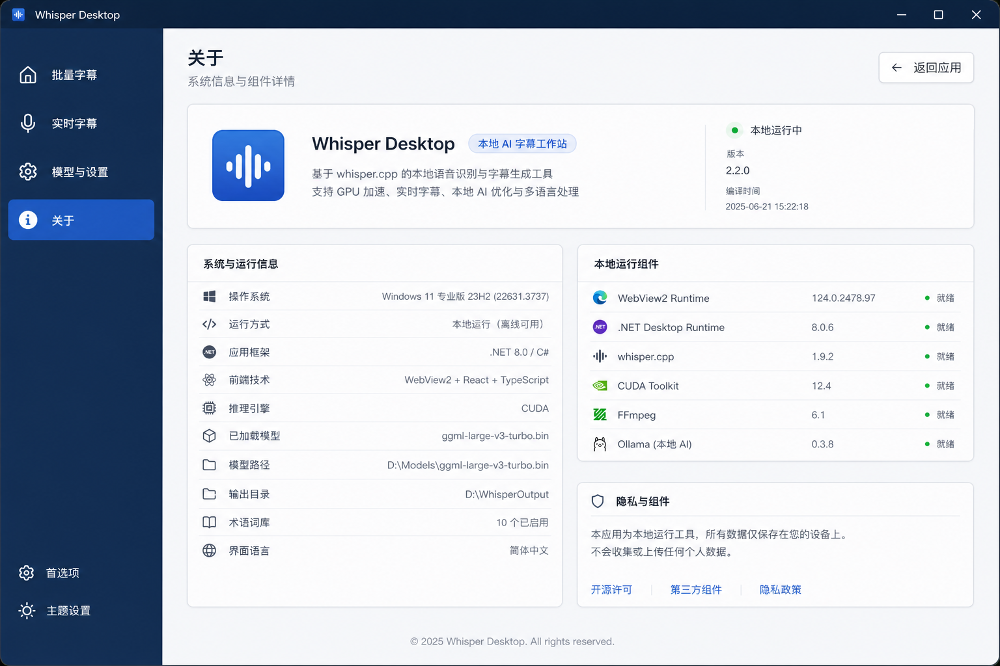

# 关于页面设计图评估

> 历史设计评估：设计图使用旧工程名 `Whisper Desktop`；当前用户可见品牌为“听录 TINGLU”。

## 页面定位

关于页面不是操作页，而是产品身份、运行环境和组件状态页。它应该帮助用户确认当前版本、构建时间、模型状态、引擎、输出路径、术语词库和本地/在线组件状态。设计图的结构非常适合当前项目，已经被当前实现部分吸收。

后续改版时需要把普通用户与开发者信息分层：首屏优先展示产品身份和“关注作者”入口，系统与运行信息、本地组件和诊断细节应收进“开发者信息”折叠区，默认不打扰普通用户。

### 作者链接数据

关于页“关注作者”卡片使用以下入口：

| 平台 | 文案 | 链接 |
|---|---|---|
| GitHub | 源码与反馈 | <https://github.com/geh293368-dotcom> |
| YouTube | 视频教程 | <https://www.youtube.com/@yelloweffect> |
| Bilibili | 中文动态 | <https://space.bilibili.com/155950275> |
| X / Twitter | 更新碎片 | <https://x.com/yelloweffect> |
| 微信公众号 | 长期更新 | 待补充二维码 |

## 页面分块

### 1. 左侧深色导航栏

设计图结构：

- 主导航：批量字幕、实时字幕、模型与设置、关于。
- 底部入口：首选项、主题设置。

评估：

- 关于页侧栏可以和其他页面完全一致，不需要额外“首选项/主题设置”入口。
- 主题设置目前没有真实功能，不建议在关于页单独展示。

### 2. 顶部标题区

设计图结构：

- 标题：关于。
- 副标题：系统信息与组件详情。
- 右侧：返回应用按钮。

现有能力：

- 当前 AboutPage 已有返回按钮和产品说明。

建议：

- 保留返回按钮。
- 文案统一为“关于 / 系统信息与组件详情”即可。
- 返回按钮应回到进入关于页之前的页面，当前逻辑已经接近这个方向。

### 3. 产品信息卡

设计图结构：

- 应用 Logo。
- 产品名：听录 TINGLU。
- 标签：本地 AI 字幕工作站。
- 产品说明：基于 whisper.cpp 的本地语音识别与字幕生成工具。
- 右侧：本地运行中、版本、编译时间。

现有能力：

- 当前已有构建时间 `buildTime`。
- 当前没有应用版本字段。
- 当前已有本地运行状态可由运行状态推导。

建议：

- P0：保留产品卡。
- P1：增加版本字段，需要宿主发布真实版本号，不能写死。
- 本地运行中状态可从宿主连接和页面初始化推导。

### 4. 系统与运行信息

设计图结构：

- 操作系统。
- 运行方式。
- 应用框架。
- 前端技术。
- 推理引擎。
- 已加载模型。
- 模型路径。
- 输出目录。
- 术语词库。
- 界面语言。

现有能力：

- 已有运行方式、推理引擎、模型状态、模型路径、输出目录、术语词库、构建时间。
- 没有操作系统版本。
- 没有 .NET Runtime 版本。
- 没有 WebView2 Runtime 版本。
- 没有界面语言设置。

建议：

- P0：展示已有状态，不伪造操作系统和组件版本。
- P1：宿主发布 OS 版本、.NET 版本、WebView2 Runtime 版本。
- 界面语言暂不显示，除非设置页支持界面语言。

### 5. 本地运行组件

设计图结构：

- WebView2 Runtime。
- .NET Desktop Runtime。
- whisper.cpp。
- CUDA Toolkit。
- FFmpeg。
- Ollama。
- 每项显示版本和就绪状态。

现有能力：

- 当前可以知道当前推理引擎。
- 本地 AI Provider 可以知道是否配置。
- 不一定能知道 WebView2、.NET、CUDA、FFmpeg、Ollama 版本。

建议：

- P0：以“本地运行组件”展示已有状态：Whisper 推理、AI Provider、术语词库。
- P1/P2：再做真实组件版本检测。
- 不建议显示固定版本号，尤其是 CUDA/FFmpeg/Ollama，容易过期或错误。

### 6. 隐私与组件

设计图结构：

- 本地运行工具。
- 数据只保存在设备上。
- 链接：开源许可、第三方组件、隐私政策。

现有能力：

- 项目确实以本地转写为主。
- AI Provider 可能是在线 Gemini，也可能是本地 OpenAI 兼容。

建议：

- 文案必须明确区分：批量/实时转写默认本地；AI 优化是否上传取决于 Provider。
- 如果选择 Gemini，应提示字幕内容会发送到配置的在线服务。
- 如果选择本地 OpenAI 兼容/Ollama，应提示走本机或用户配置的 Base URL。
- 开源许可和第三方组件可以 P1 加文档链接。

### 7. 底部版权

设计图结构：

- 版权文案。

建议：

- 可保留，但优先级低。
- 如果没有正式品牌/版权策略，不写也可以。

## 图标需求

| 图标 | 用途 | 优先级 | 备注 |
|---|---|---:|---|
| 应用 Logo | 产品卡 | P0 | 应单独生成大尺寸 |
| 返回箭头 | 返回应用 | P0 | 可用通用图标 |
| 本地运行状态 | 产品卡右侧 | P0 | 绿色状态点 |
| 操作系统 | 系统信息 | P1 | Windows |
| 运行方式 | 系统信息 | P0 | 代码/终端 |
| 应用框架 | 系统信息 | P1 | .NET |
| 前端技术 | 系统信息 | P1 | React/WebView |
| 推理引擎 | 系统信息 | P0 | 芯片 |
| 已加载模型 | 系统信息 | P0 | 立方体 |
| 模型路径 | 系统信息 | P0 | 文件夹 |
| 输出目录 | 系统信息 | P0 | 文件夹 |
| 术语词库 | 系统信息 | P0 | 书本/数据库 |
| 界面语言 | 系统信息 | P2 | 地球 |
| WebView2 | 组件列表 | P1 | Edge 图标或浏览器 |
| .NET Runtime | 组件列表 | P1 | .NET |
| whisper.cpp | 组件列表 | P0/P1 | 声波 |
| CUDA/NVIDIA | 组件列表 | P2 | GPU/NVIDIA |
| FFmpeg | 组件列表 | P2 | 影片/编码 |
| Ollama | 组件列表 | P1/P2 | 本地 AI |
| 隐私 | 隐私卡 | P0 | 盾牌 |
| 开源许可 | 链接 | P1 | 文档 |
| 第三方组件 | 链接 | P1 | 插件 |

## 功能映射

| 设计图元素 | 当前是否具备 | 建议 |
|---|---|---|
| 构建时间 | 已有 | P0 |
| 版本号 | 没有明确字段 | P1 |
| 本地运行中 | 可推导 | P0 |
| 推理引擎 | 已有 | P0 |
| 已加载模型/模型路径 | 已有 | P0 |
| 输出目录 | 已有 | P0 |
| 术语词库 | 已有 | P0 |
| OS 版本 | 没有 | P1 |
| WebView2 版本 | 没有 | P1 |
| .NET Runtime 版本 | 没有 | P1 |
| CUDA/FFmpeg/Ollama 版本 | 没有 | P2 |
| 隐私说明 | 文案可做 | P0 |
| 许可链接 | 没有 | P1 |

## 当前实现评价

当前关于页已经走在正确方向上：

- 已经采用产品卡 + 运行信息 + 本地组件 + 隐私说明。
- 已经使用代码版应用图标，避免从设计图低分辨率抠图。
- 已经通过 `buildTime` 显示真实构建时间。

后续需要注意：

- 不要在 UI 写死组件版本。
- 如果新增字段，要从 WPF `PublishState()` 发布到 React 类型和浏览器 mock。
- 组件检测可以慢慢补，不要阻塞当前视觉统一。

## 建议路线

P0：

- 保持当前 AboutPage 方向。
- 左侧导航和系统状态卡与其他页面统一。
- 隐私文案区分本地转写和在线 AI。

P1：

- 发布应用版本。
- 发布 OS、.NET、WebView2 版本。
- 增加开源许可、第三方组件入口。

P2：

- CUDA、FFmpeg、Ollama 版本检测。
- 自绘标题栏后再统一关于页窗口边框。
