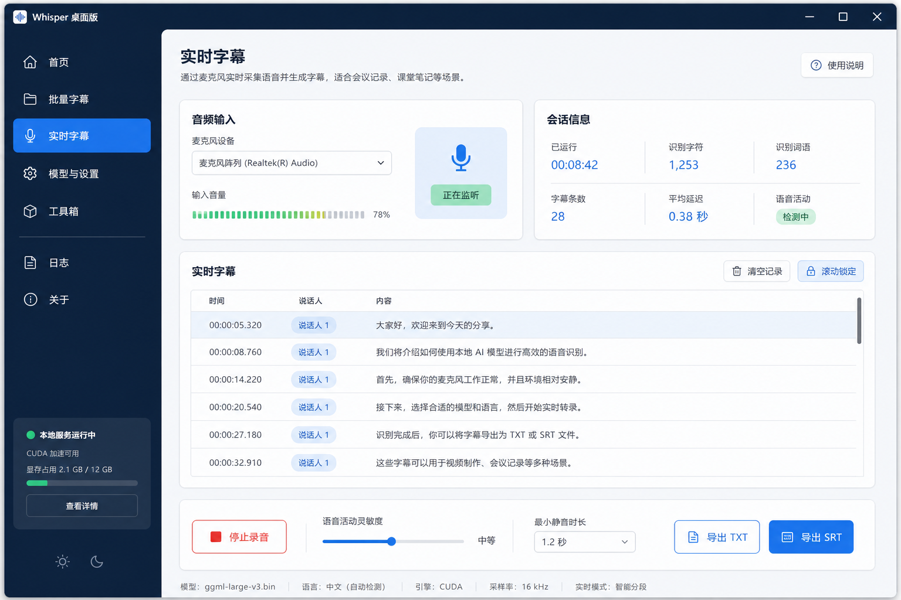

# 实时字幕页面设计图评估

## 页面定位

实时字幕页用于麦克风采集、低延迟识别、显示确认字幕、清理记录和导出 TXT/SRT。设计图将实时页拆成“音频输入、会话信息、字幕表格、底部控制条”，这个结构比当前页面更像一个会议/课堂记录工具，值得吸收。

## 页面分块

### 1. 左侧深色导航栏

设计图结构：

- 顶部品牌：Whisper 桌面版。
- 导航：主页、批量字幕、实时字幕、模型与设置、工具箱、日志、关于。
- 底部状态：本地服务运行中、CUDA 可用、显存占用、查看详情。
- 底部主题按钮：白天/夜晚。

评估：

- “主页”和“工具箱”目前没有明确功能，不建议 P0 新增。
- “日志”也可以先不做独立页面。
- 底部状态卡设计很好，但显存占用不能先做假数据。
- 主题日夜切换是一个真实设置系统，不是单个按钮；建议 P2。

### 2. 顶部标题和说明

设计图结构：

- 标题：实时字幕。
- 描述：通过麦克风实时采集语音并生成字幕。
- 右侧：使用说明按钮。

现有能力：

- 已有实时字幕页面。
- 已有麦克风设备、语言、状态、导出。
- 没有“使用说明”页面。

建议：

- P0 保留标题与说明。
- “使用说明”可先不做，或者链接到现有文档/README；没有内容时不要加按钮。

### 3. 音频输入卡

设计图结构：

- 麦克风设备下拉框。
- 输入音量条。
- 大号麦克风图标。
- 状态：正在监听。

现有能力：

- 已有 `captureDevices` 和 `selectedCaptureDevice`。
- 已有 `liveVoiceDetected`，当前是一个语音活动条。
- 没有实时音量百分比。

建议：

- P0：采用更明确的麦克风卡片布局。
- P0：继续用 `liveVoiceDetected` 表示等待人声/检测到说话，不显示百分比。
- P1：如果音频采集层能发布 RMS/峰值，再做 0-100% 音量条。

### 4. 会话信息卡

设计图结构：

- 已运行。
- 识别字符。
- 识别词语。
- 字幕条数。
- 平均延迟。
- 语音活动。

现有能力：

- 已有会话时长 `liveElapsedSeconds`。
- 已有字幕条数 `liveSegments.length`。
- 已有识别状态。
- 没有字符数、词语数、平均延迟。

建议：

- P0：显示已有三项：会话时长、确认字幕、识别状态、实时引擎。
- P1：字符数可以从 `liveSegments` 前端推导，风险低。
- P1/P2：平均延迟需要宿主记录音频片段结束到字幕生成的时间，不建议前端猜。

### 5. 实时字幕表格

设计图结构：

- 表格列：时间、说话人、内容。
- 右上操作：清空记录、滚动锁定。

现有能力：

- 已有时间和内容。
- 没有说话人识别。
- 已有清空。
- 没有滚动锁定，目前自动滚动到底部。

建议：

- P0：保留时间 + 内容，不加说话人列。
- P1：增加滚动锁定，这是前端状态，不需要后端。
- P2：说话人识别单独评估，需要 diarization 能力，不只是 UI。

### 6. 底部控制条

设计图结构：

- 停止录音。
- 语音活动灵敏度滑块。
- 最小静音时长。
- 导出 TXT。
- 导出 SRT。
- 底部状态：模型、语言、引擎、采样率、实时模式。

现有能力：

- 已有开始/停止实时字幕。
- 已有导出 TXT/SRT。
- 没有灵敏度滑块。
- 当前实时参数写死在宿主服务里。
- 有语言、引擎/模型状态，但实时链路目前不完全等同批量 CUDA 后端。

建议：

- P0：吸收底部控制条排版，展示开始/停止、清空、复制、导出 TXT/SRT。
- P0：底部状态显示模型、语言、实时模式。
- P1/P2：灵敏度、最小静音时长需要宿主参数可配置后再做。
- 实时页的引擎文案要谨慎。当前实时字幕使用兼容流式链路时，不应显示“CUDA”误导用户。

## 图标需求

| 图标 | 用途 | 优先级 | 备注 |
|---|---|---:|---|
| 实时字幕/麦克风 | 导航和主卡 | P0 | 页面核心图标 |
| 首页 | 设计图导航 | P2 | 暂不建议新增主页 |
| 工具箱 | 设计图导航 | P2 | 暂无对应功能 |
| 日志 | 导航 | P1 | 可后续独立化 |
| 帮助 | 使用说明 | P1/P2 | 没有说明页时不显示 |
| 状态点 | 本地服务运行中 | P0 | 统一系统状态 |
| 太阳/月亮 | 主题切换 | P2 | 主题系统再做 |
| 清空记录 | 字幕表格操作 | P0 | 垃圾桶 |
| 滚动锁定 | 字幕表格操作 | P1 | 锁头 |
| 停止录音 | 底部按钮 | P0 | 红色停止方块 |
| 导出 TXT | 导出按钮 | P0 | 文档 |
| 导出 SRT | 导出按钮 | P0 | 字幕卡片 |
| 语音活动 | 状态/灵敏度 | P0/P1 | 音波 |
| 模型 | 底部状态 | P0 | 立方体 |
| 语言 | 底部状态 | P0 | 地球 |
| 引擎 | 底部状态 | P0 | 芯片 |

## 功能映射

| 设计图元素 | 当前是否具备 | 建议 |
|---|---|---|
| 麦克风选择 | 已有 | P0 重排 |
| 输入音量百分比 | 没有 | P1/P2 |
| 正在监听状态 | 已有 | P0 |
| 会话时长 | 已有 | P0 |
| 字幕条数 | 已有 | P0 |
| 识别字符/词语 | 可前端推导/部分困难 | P1 |
| 平均延迟 | 没有 | P2 |
| 说话人 | 没有 | P2 |
| 清空记录 | 已有 | P0 |
| 滚动锁定 | 没有，但前端可做 | P1 |
| 导出 TXT/SRT | 已有 | P0 |
| 灵敏度/静音时长 | 没有可配置 UI | P2 |
| 主题按钮 | 没有 | P2 |

## 声音提示

实时字幕页适合加轻量提示音，但只在这些场景触发：

- 实时会话停止并成功保存。
- 导出 TXT/SRT 成功。
- 录音设备不可用或模型加载失败。

不建议每识别一句话就响，会干扰录音和用户判断。

## 建议路线

P0：

- 重排为音频输入、会话信息、实时字幕、底部控制条。
- 状态文案与当前真实链路一致，不显示假 CUDA。
- 保留导出 TXT/SRT。

P1：

- 滚动锁定。
- 字符数统计。
- 完成/导出提示音。

P2：

- 主题切换。
- 灵敏度和静音时长。
- 平均延迟。
- 说话人识别。
