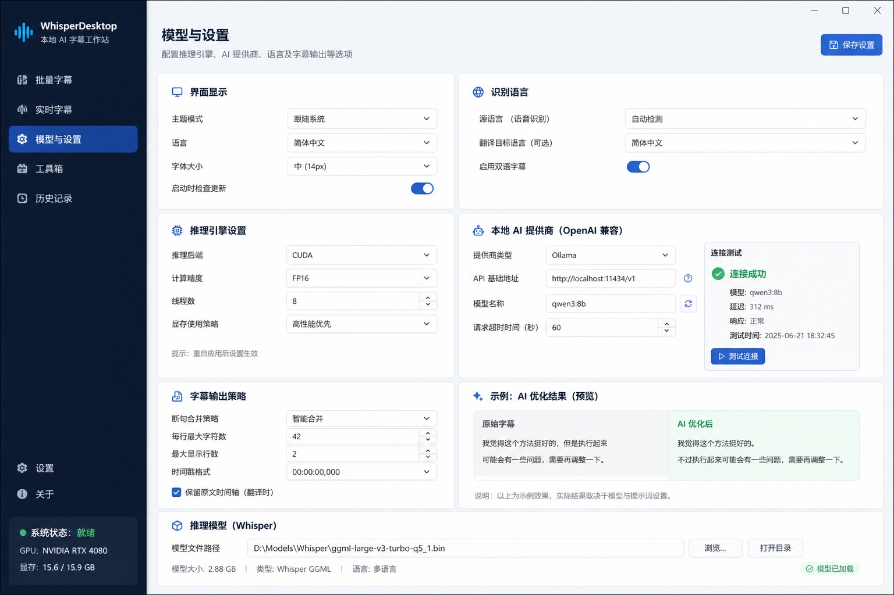

# 模型与设置页面设计图评估

## 页面定位

模型与设置页是配置中心。它应该集中管理界面显示、识别语言、推理引擎、本地/在线 AI Provider、字幕输出策略、模型文件、术语词库和诊断选项。设计图把设置拆成多个卡片，信息密度高但仍然清晰，是四张图里最适合作为结构参考的一张。

## 页面分块

### 1. 左侧导航和系统状态

设计图结构：

- 品牌：WhisperDesktop，本地 AI 字幕工作站。
- 导航：批量字幕、实时字幕、模型与设置、工具箱、历史记录。
- 底部：设置、关于。
- 系统状态卡：就绪、GPU、显存。

评估：

- 品牌、主导航和底部系统状态值得统一到所有页面。
- 工具箱、历史记录目前没有明确产品定位，不建议 P0 加。
- GPU/显存可以先替换成已有状态：推理引擎、模型状态、本地 AI 状态。

### 2. 页面标题和保存设置

设计图结构：

- 标题：模型与设置。
- 描述：配置推理引擎、AI 提供商、语言及字幕输出等选项。
- 右侧按钮：保存设置。

现有能力：

- 当前设置变更基本是即时保存或通过 WPF `SaveConfig()`。
- 没有“保存设置”按钮语义。

建议：

- P0 不建议新增“保存设置”按钮，除非改成显式保存模式。
- 如果保留即时保存，页面右上角可以显示“设置会自动保存”或不显示按钮。
- 不要出现点了“保存设置”但实际没有状态反馈的按钮。

### 3. 界面显示

设计图结构：

- 主题模式。
- 语言。
- 字体大小。
- 启动时检查更新。

现有能力：

- 已有 `uiScale`：小/中/大。
- 没有主题模式。
- 没有界面语言切换。
- 没有检查更新。

建议：

- P0：保留“界面字号”并改善布局。
- P2：主题模式需要 CSS 变量、持久化字段和全局样式重构。
- 界面语言暂不优先，当前主要面向中文用户。
- 检查更新不建议现在做，涉及发布源和版本策略。

### 4. 识别语言

设计图结构：

- 源语言：自动检测。
- 翻译目标语言：简体中文。
- 启用双语字幕。

现有能力：

- 已有 `selectedLanguage`，当前语言列表不含自动检测。
- 已有 `translate`，但这是 Whisper 原生翻译为英文，不是双语字幕。
- 没有翻译目标语言。
- 没有双语字幕输出。

关键判断：

当前 `translate` 不能等同于“启用双语字幕”。双语字幕应该产生原文和译文，可能是一条字幕两行，也可能是两个文件。它还涉及 AI 翻译或 Whisper 翻译链路，不能只加一个开关。

建议：

- P0：保留源语言选择和现有翻译为英文开关，但文案要讲清楚。
- P1/P2：如果 Whisper 后端支持自动语言检测，可以增加“自动检测”；否则不要显示。
- P2：单独做双语字幕设计。

### 5. 推理引擎设置

设计图结构：

- 推理后端：CUDA。
- 计算精度：FP16。
- 线程数。
- 显存使用策略。

现有能力：

- 已有推理引擎选择：CUDA、CPU、D3D11。
- 没有计算精度选项。
- 没有线程数配置。
- 没有显存使用策略。

建议：

- P0：把当前“推理引擎”放到更显眼的位置。
- P1：可以显示当前后端名称和模型加载状态。
- P2：计算精度、线程数、显存策略需要后端支持，不要先画控件。

### 6. 本地 AI 提供商

设计图结构：

- 提供商类型：Ollama。
- API 基础地址。
- 模型名称。
- 请求超时时间。
- 连接测试详情：成功、模型、延迟、响应、测试时间。
- 测试连接按钮。

现有能力：

- 已有 AI Provider：Gemini、本地 OpenAI 兼容。
- 已有 Base URL。
- 已有模型名。
- 已有测试连接命令。
- 当前连接测试详情比较简单。
- 没有可配置请求超时时间。

建议：

- P0：重排成本地 AI 卡片，保留 Provider、Base URL、模型名、测试连接。
- P1：连接测试结果结构化显示：状态、模型、耗时、错误类别、测试时间。
- P2：请求超时时间可配置，前提是宿主和模型客户端支持。

### 7. 字幕输出策略

设计图结构：

- 断句合并策略。
- 每行最大字符数。
- 最大显示行数。
- 时间戳格式。
- 保留原文时间轴。

现有能力：

- 已有 AI 字幕输出策略：覆盖原字幕并备份 / 保留原字幕输出优化副本。
- 没有断句合并策略。
- 没有每行字符数和最大显示行数。
- 没有时间戳格式设置。

建议：

- P0：保留当前 AI 输出策略，并把文案讲清楚。
- P1：如果现有字幕后处理已有安全规则，可以在这里显示策略说明。
- P2：断句合并、行宽、时间轴保留都是字幕后处理功能，需要单独设计。

### 8. AI 优化结果预览

设计图结构：

- 左侧：原始字幕。
- 右侧：AI 优化后。
- 下方说明。

现有能力：

- 当前已有优化试跑 textarea 和结果区域。

建议：

- 强烈建议 P0/P1 吸收这个布局。
- 不需要新后端，只要把当前试跑结果改成左右对比，更直观。
- 如果没有配置 AI Provider，右侧显示空状态。

### 9. 推理模型

设计图结构：

- 模型文件路径。
- 浏览。
- 打开目录。
- 模型大小。
- 类型。
- 语言。
- 模型已加载状态。

现有能力：

- 已有模型路径、最近模型、选择模型、加载模型、自动加载。
- 已有 `modelStatus`。
- 没有文件大小字段。
- 没有模型类型/语言元数据。

建议：

- P0：重排模型路径、选择模型、加载模型、自动加载。
- P1：发布模型文件大小，简单可靠。
- P1/P2：类型和语言先从文件名启发式显示，或后续读 GGML 元数据；不要写死。

## 图标需求

| 图标 | 用途 | 优先级 | 备注 |
|---|---|---:|---|
| 保存设置 | 页面右上 | P2 | 如果即时保存则不需要 |
| 界面显示 | 显示卡 | P0 | 显示器 |
| 主题 | 主题模式 | P2 | 太阳/月亮 |
| 字号 | 字体大小 | P0 | 可不用图标 |
| 语言识别 | 识别语言卡 | P0 | 地球 |
| 双语字幕 | 未来功能 | P2 | 双气泡/双文档 |
| 推理引擎 | 推理卡 | P0 | 芯片 |
| 本地 AI | Provider 卡 | P0 | 机器人 |
| 连接测试 | 测试按钮 | P0 | 播放/闪电 |
| 成功状态 | 测试结果 | P0 | 绿色对勾 |
| 刷新模型 | 模型名旁按钮 | P1 | 循环箭头 |
| 字幕输出策略 | 输出卡 | P0 | 文档 |
| AI 优化 | 预览卡 | P0 | 星光 |
| 原始字幕 | 对比左侧 | P0 | 文档 |
| 优化后 | 对比右侧 | P0 | 星光/对勾 |
| 推理模型 | 模型卡 | P0 | 立方体 |
| 浏览 | 模型路径 | P0 | 文件夹 |
| 打开目录 | 模型路径 | P0 | 文件夹打开 |

## 功能映射

| 设计图元素 | 当前是否具备 | 建议 |
|---|---|---|
| 字体大小 | 已有 | P0 |
| 主题模式 | 没有 | P2 |
| 界面语言 | 没有 | 暂不做 |
| 检查更新 | 没有 | P2/暂不做 |
| 源语言 | 已有 | P0 |
| 自动检测 | 未明确支持 | P1/P2 |
| 翻译目标语言 | 没有 | P2 |
| 双语字幕 | 没有 | P2 |
| 推理引擎 | 已有 | P0 |
| 计算精度/线程/显存策略 | 没有 | P2 |
| 本地 AI Provider | 已有 | P0 |
| Base URL/模型名 | 已有 | P0 |
| 请求超时 | 没有 | P2 |
| 连接测试详情 | 部分已有 | P1 |
| 字幕输出策略 | 已有一部分 | P0/P1 |
| 原始/优化对比 | 部分已有 | P1 |
| 模型路径/加载 | 已有 | P0 |
| 模型大小 | 没有 | P1 |
| 模型类型/语言 | 没有 | P1/P2 |

## 建议路线

P0：

- 按设计图分卡片重排已有设置。
- 推理引擎、本地 AI、模型路径、AI 输出策略放到更醒目位置。
- 不新增保存按钮，保持即时保存逻辑。

P1：

- AI 连接测试详情。
- 原始字幕/优化后左右对比。
- 模型文件大小。
- 任务完成提示音开关。

P2：

- 主题模式。
- 自动语言检测。
- 双语字幕。
- 计算精度、线程数、显存策略。
- 请求超时配置。
